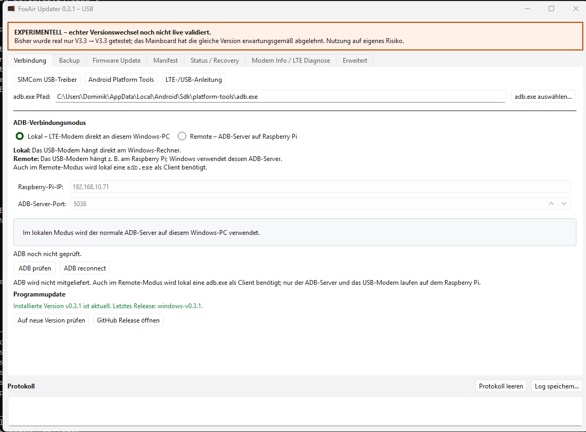
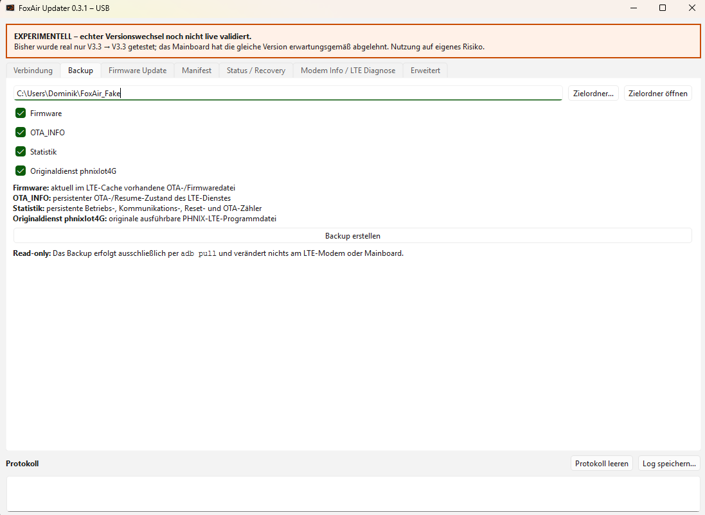
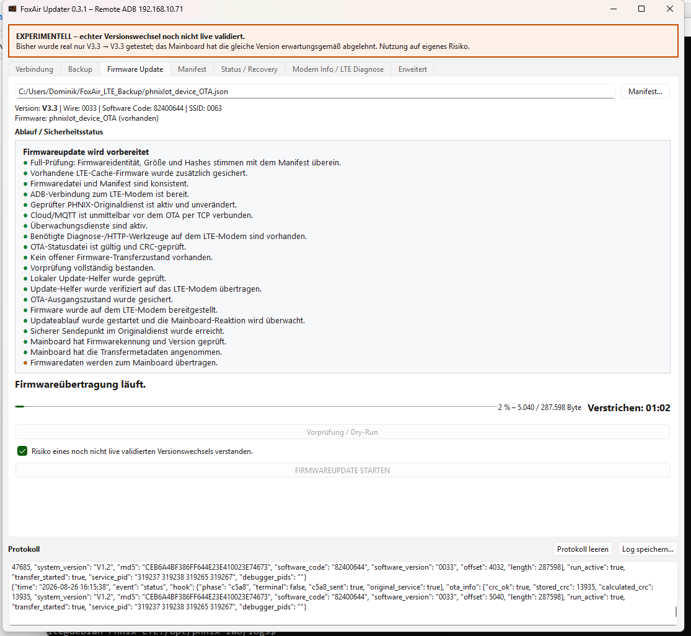
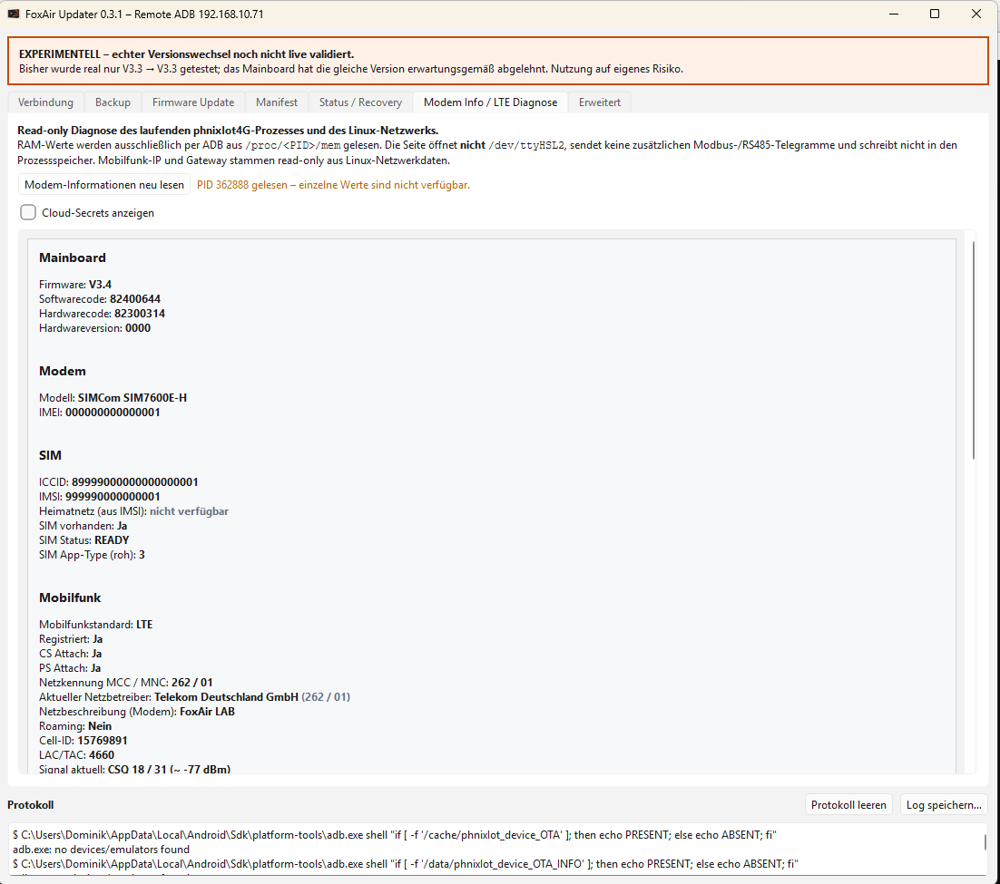

# FoxAir Updater

Firmware-Update- und Reverse-Engineering-Tool für FoxAir-/PHNIX-Wärmepumpen.

> [!CAUTION]
> ## V3.3 → V3.4 live validiert
>
> Ein vollständiges Firmwareupdate von Mainboard V3.3 auf V3.4 wurde auf realer Hardware **erfolgreich durchgeführt und anschließend über Status 5 / Board-Step 12 sowie die neue C544-Versionsmeldung `0034` bestätigt**.
>
> Zusätzlich wurde **V3.3 → V3.3** bis zur erwarteten Gleichversionsablehnung getestet. Andere Firmwarestände, Mainboardfamilien und Fehlerfälle sind weiterhin nicht vollständig live validiert.
>
> Ein Firmwareupdate bleibt ein Eingriff in das Mainboard. Im ungünstigsten Fall können Mainboard, LTE-Modem oder der normale Betrieb der Wärmepumpe beeinträchtigt werden und ein manueller Recovery- oder Reparatureingriff erforderlich werden.
>
> **Nutzung ausschließlich auf eigenes Risiko.** Der Ersteller übernimmt, **soweit gesetzlich zulässig**, keine Gewährleistung, Sachmängelhaftung oder Haftung für Schäden oder Folgeschäden, die aus der Verwendung oder Fehlfunktion dieses Tools entstehen.

Das Repository trennt Firmwareanalyse und Update-Werkzeuge bewusst vom Projekt [`FoxAir_Control`](https://github.com/dosordie/FoxAir_Control), das weiterhin für normale Steuerung, Modbus-Auswertung und Diagnose zuständig ist.

## Windows GUI v0.3.9

Die Windows-Version ist inzwischen der hauptsächliche Entwicklungsweg des Projekts. Sie steht als **Portable-ZIP** und **Setup-EXE** auf der GitHub-Releases-Seite bereit:

**[FoxAir Updater – GitHub Releases](https://github.com/dosordie/FoxAir_updater/releases)**

Release-Details zu v0.3.9:

**[`docs/RELEASE_NOTES_WINDOWS_v0.3.9.md`](docs/RELEASE_NOTES_WINDOWS_v0.3.9.md)**

ADB wird weiterhin **nicht mitgeliefert**. Die GUI verlinkt den SIMCom-USB-Treiber, die offiziellen Android Platform Tools und die LTE-/USB-Anleitung. Eine vorhandene `adb.exe` kann ausgewählt und gespeichert werden.

> [!NOTE]
> Die Windows-Builds sind derzeit nicht mit einem kommerziellen Code-Signing-Zertifikat signiert. Windows SmartScreen kann deshalb beim ersten Start **„Der Computer wurde durch Windows geschützt“** anzeigen. Wenn die Datei bewusst von der offiziellen GitHub-Releases-Seite geladen wurde, **Weitere Informationen** und anschließend **Trotzdem ausführen** wählen.

### Was die Windows-Version bietet

- lokale ADB-Verbindung direkt per USB;
- optional Remote-ADB über einen Raspberry Pi;
- automatische bzw. manuelle ADB-Reconnect-Funktion;
- read-only Backup/Firmware-Download per `adb pull`;
- Sicherung von Firmware-Cache, `OTA_INFO`, Statistik und optional dem Originaldienst `phnixIot4G`;
- Originalstatus- und Recovery-Prüfung;
- Firmware-Dry-Run;
- Manifest-Erzeugung direkt aus einer Firmwaredatei;
- automatischen Full-Abgleich von Manifest, Firmwareidentität, Größe, MD5 und SHA256;
- lesbare Ablauf- und Fortschrittsanzeige für den Firmwareupdate-Pfad;
- standardmäßig verbundene MQTT-Cloud während des Vollupdates;
- optionale MQTT-Isolierung unter **Erweitert → MQTT bei Update aus** für besondere Testfälle;
- read-only Modem-, SIM-, LTE-, Cloud-/MQTT- und Mainboarddiagnose;
- optionale detaillierte Modem-/Traffic-Diagnose unter **Erweitert**;
- Wartungsfunktion für den Mainboard-OTA-Vorgangszähler;
- Loganzeige und Logexport;
- Portable- und Setup-Build ohne notwendige Python-Installation beim Anwender.

### Neu bzw. maßgeblich in v0.3.9

- **V3.3 → V3.4 wurde real erfolgreich geflasht.** Die neue Firmware wurde nach dem vollständigen Ablauf als V3.4 / `0034` bestätigt.
- MQTT bleibt bei einem normalen Vollupdate **standardmäßig verbunden**. Die frühere Firewall-Isolierung ist nur noch optional.
- Die Option **MQTT bei Update aus** befindet sich unter **Erweitert**, ist standardmäßig aus und wird persistent gespeichert.
- Die OTA-Vorprüfung verlangt weiterhin einen sauberen Originalzustand und eine aktive MQTT-/Cloud-Verbindung.
- **100 % bedeutet nur: alle C5A8-Firmwaredaten übertragen.** Die anschließende Mainboard-Prüf-/Flash-/Promotionphase läuft weiter.
- Erst **C36E Status 5 / Board-Step 12** gilt als terminaler Mainboard-Erfolg.
- Nach dem terminalen Mainboardergebnis erhält der normale LTE-/Cloudzustand bis zu **120 Sekunden**, bevor die Abschlussprüfung fehlschlägt.
- Bei einem kurzzeitigen ADB-Verbindungsverlust kann die GUI den vorhandenen OTA-Zustand erneut read-only prüfen, ohne einen zweiten Updatevorgang zu starten.
- Nach begonnenem C5A8-Firmwaretransfer bleibt der originale `phnixIot4G`-Dienst autoritativ; ein reiner Windows-/ADB-Monitoringfehler darf den laufenden Transfer nicht aktiv stoppen.
- Die frühere allgemeine **Experimentell**-Kennzeichnung wurde aus der Windows-Oberfläche entfernt. Der Risikohinweis für Firmwareupdates bleibt bestehen.
- Der separate Gleichversionstest und die passive-Logger-Checkbox sind nicht mehr Bestandteil der normalen Endanwender-GUI; die Backend-/Lab-Funktionen bleiben für Entwicklung erhalten.

### MQTT und der 30-Minuten-Rebootpfad

Der Originaldienst besitzt einen eigenen Rebootmechanismus, wenn der Aliyun-MQTT-Client intern länger als 1800 Sekunden als offline gilt.

Wichtig ist die genaue Bedeutung: Der 1800-s-Zähler startet **nicht zwingend in dem Moment, in dem Netzwerkpakete per Firewall geblockt werden**. Bei einer stillen `iptables DROP`-Sperre kann der Aliyun-SDK mehrere 180-s-Keepalive-Zyklen benötigen, bevor sein interner Clientzustand von „connected“ auf „offline“ wechselt. Erst danach läuft der PHNIX-1800-s-Zähler.

Damit ist der Rebootpfad weiterhin real vorhanden; es gibt keinen bekannten OTA-Sonderzweig, der ihn während eines Mainboardupdates deaktiviert. Für normale Updates ist es deshalb einfacher und risikoärmer, MQTT verbunden zu lassen.

Details:
[`PHNIX_phnixIot4G_watchdogs_reset_counters.md`](docs/reverse_engineering/PHNIX_phnixIot4G_watchdogs_reset_counters.md)

### Screenshots

> [!NOTE]
> Die Screenshots zeigen den grundsätzlichen Aufbau der Windows-GUI. Einzelne Texte und Optionen können gegenüber v0.3.9 leicht abweichen.

| Verbindung | Backup |
|---|---|
|  |  |

| Firmware Update | Modem Info / LTE Diagnose |
|---|---|
|  |  |

### Aktuell real bestätigt

Real getestet bzw. bestätigt sind unter anderem:

- lokale und Remote-ADB-Verbindung;
- Originalstatus;
- read-only LTE-Backup/Firmware-Download;
- Dry-Run;
- normaler Windows-Firmware-Update-Aufruf mit **V3.3 → V3.3** bis zur sicheren Gleichversionsablehnung;
- vollständiger realer Versionswechsel **V3.3 → V3.4**, einschließlich kompletter C5A8-Übertragung, C36E Status 3, C36E Status 5 / Board-Step 12 und anschließender C544-Versionsbestätigung `0034`;
- Mainboard-OTA-Vorgangszähler-Wartung einschließlich Sicherung, kontrolliertem Dienstneustart und Verifikation.

Beim V3.3→V3.3-Test erkannte das Mainboard die bereits installierte Firmware und beendete den Ablauf vor C357/C5A8. Es wurden keine Firmwaredaten übertragen.

Beim V3.3→V3.4-Lauf dauerte die C5A8-Datenübertragung rund **28:56 Minuten**. Vom letzten Datenblock bis Status 5 vergingen weitere rund **5:16 Minuten**. Bis zur ersten neuen C544-Versionsmeldung dauerte der vollständige beobachtete Ablauf rund **35 Minuten**.

Details stehen in:
[`PHNIX_V33_TO_V34_LIVE_UPDATE_2026-08-29.md`](docs/reverse_engineering/PHNIX_V33_TO_V34_LIVE_UPDATE_2026-08-29.md)

### Windows-Architektur

Die Windows-Version hält die gemeinsame OTA-Logik bewusst zentral:

```text
FoxAir_Updater.exe
        ↓
Windows-GUI / Statusdarstellung
        ↓
private Python Runtime
        ↓
Windows-Sicherheitswrapper
        ↓
gemeinsamer PHNIX OTA-Controller
        ↓
extern ausgewählte adb.exe
        ↓
PHNIX LTE-Modem
```

Der Windows-Build verwendet die gemeinsamen Controller- und `updater/common`-Quellen und hält damit keine separate zweite OTA-Implementierung vor.

Details zum Windows-Build und zur internen Architektur stehen unter [`updater/windows/README.md`](updater/windows/README.md).

### Remote ADB über Raspberry Pi

Wenn das LTE-Modem per USB an einem Raspberry Pi hängt, kann der ADB-Server im lokalen LAN bereitgestellt werden:

```bash
adb kill-server
adb -a -P 5038 nodaemon server
```

Zum Beenden auf dem Raspberry Pi **Strg+C** drücken. In der Windows-GUI werden IP-Adresse und Port eingetragen. Auch im Remote-Modus wird unter Windows eine lokale `adb.exe` als Client benötigt.

Der Remote-ADB-Port sollte nur in einem vertrauenswürdigen lokalen Netz freigegeben werden.

## Linux / Raspberry Pi

Der Linux-/Raspberry-Pi-Weg bleibt weiterhin nutzbar und verwendet denselben gemeinsamen OTA-Kern.

Als normaler Benutzer ausführen, **nicht** mit `sudo` starten:

```sh
cd ~
wget -O install.sh \
  https://raw.githubusercontent.com/dosordie/FoxAir_updater/main/updater/linux/install.sh
bash install.sh
```

Danach stehen unter anderem zur Verfügung:

```text
./foxair-updater status
./foxair-updater check MANIFEST
./foxair-updater update MANIFEST --confirm
./foxair-updater restore
./foxair-updater manifest FIRMWARE ...
./foxair-updater version
```

Der Installer:

- prüft bzw. installiert `python3`, `adb`, `usbutils`, `git` und CA-Zertifikate;
- verlangt Python 3.10 oder neuer;
- verwendet einen schlanken Git-Sparse-Checkout;
- richtet den USB-Zugriff für das PHNIX-LTE-Modem `1e0e:9001` ein;
- berücksichtigt ein kurzzeitig `offline` erscheinendes ADB-Gerät und versucht `adb reconnect`;
- erstellt den lokalen Firmwareordner `~/FoxAir_updater/firmware`;
- prüft Controller, Manifestwerkzeug und Launcher.

Ausführliche Updater-Anleitung:
[`docs/HowTo/PHNIX_UPDATER_ENDANWENDER.md`](docs/HowTo/PHNIX_UPDATER_ENDANWENDER.md)

Anschluss des LTE-Modems, Micro-USB, Windows-/Linux-ADB und Backup:
[`docs/HowTo/firmware_backup_lte.md`](docs/HowTo/firmware_backup_lte.md)

## Firmware-Backup / Firmware-Download

Unter Windows ist die grafische Backup-Funktion der empfohlene Weg. Sie verwendet ausschließlich read-only `adb pull`.

Gesichert werden können:

- `/cache/phnixIot_device_OTA` – aktuell im LTE-Cache vorhandene Firmware-/OTA-Datei;
- `/data/phnixIot_device_OTA_INFO` – persistenter OTA-/Resume-Zustand;
- `/data/phnixIot_device_statisic` – persistente Betriebs-, Reset-, Kommunikations- und OTA-Zähler;
- `/data/phnixIot4G` – originaler PHNIX-LTE-Dienst.

Die vollständige Anleitung steht unter:

**[`docs/HowTo/firmware_backup_lte.md`](docs/HowTo/firmware_backup_lte.md)**

Firmware- und Datendateien aus dem LTE-Modem werden nicht automatisch veröffentlicht und sollen insbesondere nicht in dieses öffentliche Repository eingecheckt werden.

## Firmware und Manifest

Firmwaredateien werden **nicht über dieses öffentliche GitHub-Repository verteilt**. Der Installer lädt keine Mainboard-Firmware herunter.

Das Manifest beschreibt die zu übertragende Firmware eindeutig und enthält bzw. bindet unter anderem:

- Software-/Produktcode;
- Firmwareversion;
- Ziel-/SSID;
- Dateigröße;
- MD5;
- SHA256;
- Referenz auf die zugehörige Firmwaredatei.

Damit prüft der Updater vor dem eigentlichen OTA, dass die ausgewählte Firmwaredatei exakt zu den erwarteten Metadaten und Prüfsummen passt.

Unter Windows ist die automatische Full-Variante der empfohlene Weg: Firmware auswählen, analysieren lassen und Manifest automatisch erzeugen. Die Firmwaredatei wird dabei nicht verändert und muss keine `.bin`-Endung besitzen.

Unter Linux kann ein Manifest ebenfalls lokal erzeugt werden, zum Beispiel:

```sh
cd ~/FoxAir_updater
./foxair-updater manifest FW3.4.bin \
  --software-code 82400644 \
  --display-version V3.4 \
  --target-ssid 0063
```

Weitere Details:
[`docs/HowTo/FIRMWARE_MANIFEST.md`](docs/HowTo/FIRMWARE_MANIFEST.md)

## Technische Sicherheitsgrenze

Der aktuelle Live-Pfad ist für genau den untersuchten Originaldienst `phnixIot4G` ausgelegt:

```text
Build-ID: af4dcae12639bedce833ee5efa5da009777b6319
SHA-256:  7c573431f0a67620d473419644a83a4f4dc04b8a91bde5923c74a63ba1eaedb7
```

Der frühe OTA-Vorhandshake und der eigentliche Firmwaretransfer werden bewusst unterschiedlich behandelt:

- **Vor dem ersten C5A8** kann ein kontrollierter Guarded-Hold-/Recoverypfad verwendet werden.
- **Ab dem ersten C5A8** ist der originale PHNIX-Dienst autoritativ; ein Monitoringfehler darf den Transfer nicht automatisch abbrechen.
- `C36E Status 3` ist **kein sicherer Stopppunkt**.
- Ein fehlendes `C37B/3` stoppt die anschließende Mainboard-Promotion nicht; das ACK gehört zur Status-/Retrylogik und ist kein Promotion-Gate.
- **100 % C5A8 ist nicht terminal.** Erst Status 5 / Board-Step 12 bestätigt den Mainboardabschluss.

Diese Erkenntnisse basieren auf der analysierten Mainboard-Firmware V3.3 und dem erfolgreichen V3.3→V3.4-Live-Lauf. Details befinden sich unter [`docs/reverse_engineering/`](docs/reverse_engineering/).

## Repository-Struktur

```text
FoxAir_updater/
├─ docs/
│  ├─ reverse_engineering/  # Mainboard-, OTA- und LTE-Analyse
│  └─ HowTo/                # Anwender- und Testanleitungen
├─ firmware_manifests/      # geprüfte/analysierte Manifest-Metadaten
├─ updater/
│  ├─ common/               # gemeinsam genutzte Python-Module
│  ├─ linux/                # Linux-/Raspberry-Pi-Installer
│  └─ windows/              # Windows-GUI, Portable-/Setup-Build
├─ tools/phnix_ota/         # OTA-Controller, Runtime-Helfer, Manifestwerkzeug
├─ devtools/                # Simulatoren und Laborwerkzeuge
├─ tests/                   # Regressionstests
└─ foxair-updater           # Linux-Endanwender-Launcher
```

## Projektumfang

Enthalten sind unter anderem Firmware-Reverse-Engineering, PHNIX-LTE-Modem-/Runtime-Analyse, OTA-/IAP-Protokollanalyse, Firmwareupdate-, Recovery- und Validierungswerkzeuge, Manifest-/Hashprüfung sowie Simulatoren und Regressionstests.

Nicht Schwerpunkt dieses Repositorys sind die normale FoxAir-Control-GUI, normale Endanwender-Steuerlogik oder allgemeine Modbus-Werkzeuge ohne direkten Firmware-/Updater-Bezug.

## 💙 Unterstützung

Ich bastle an diesem Tool in meiner Freizeit.  
Wenn er dir gefällt oder dir weiterhilft, freue ich mich über eine kleine Spende:

[](https://www.paypal.com/paypalme/AuhuberD)

## Lizenz

Dieses Repository steht unter der **GNU General Public License v3.0**, SPDX-Kennung **`GPL-3.0-only`**.

Siehe [`LICENSE`](LICENSE).

Weitergabe und Änderungen sind damit erlaubt, abgeleitete Werke müssen bei Weitergabe jedoch ebenfalls unter den Bedingungen der GPLv3 stehen und der zugehörige Quellcode muss gemäß den Lizenzbedingungen verfügbar gemacht werden.

Die GPL enthält ausdrücklich einen Gewährleistungs- und Haftungsausschluss.