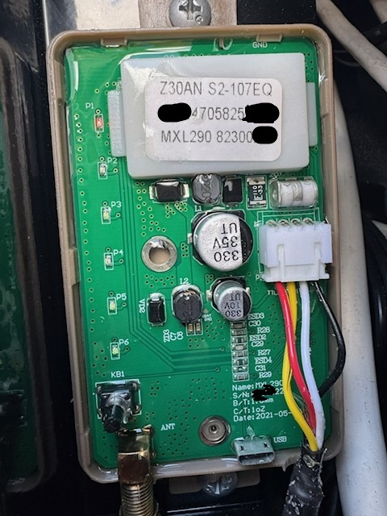
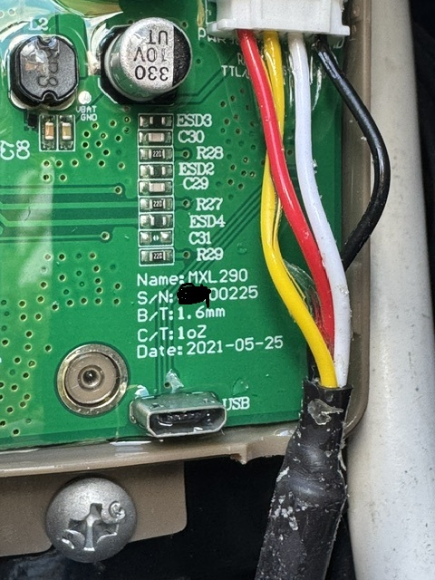

# Firmware-Backup des LTE-Modems über Micro-USB

Diese Anleitung beschreibt kurz, wie man sich per **Micro-USB** mit dem LTE-Modem verbindet und die Firmware sowie einige zusätzliche Dateien mit **ADB (Android Debug Bridge, Bestandteil der Android SDK Platform Tools)** sichert.

> [!NOTE]
> Es gibt zwei alternative Wege:
> - **Windows**: siehe Abschnitte 2 bis 6
> - **Linux / Raspberry Pi**: siehe Abschnitt 7
>
> Es muss **nur einer der beiden Wege** verwendet werden. Die Linux-Anleitung ist eine Alternative zur Windows-Anleitung, kein zusätzlicher notwendiger Schritt.

> [!NOTE]
> Die in dieser Anleitung verwendeten ADB-Befehle **verändern nichts am LTE-Modem**. Mit `adb pull` werden die angegebenen Dateien lediglich vom LTE-Modem auf den PC bzw. Raspberry Pi **heruntergeladen/kopiert**. Die beschriebenen Backup-Schritte können daher gefahrlos verwendet werden.

> [!WARNING]
> Die aus dem LTE-Modem ausgelesenen Firmware- und Datendateien **nicht öffentlich hochladen oder weiterveröffentlichen**. Sie können herstellerspezifische Software, Konfigurationsdaten oder andere nicht für die Veröffentlichung bestimmte Inhalte enthalten.

## 1. LTE-Modem öffnen und USB-Port freilegen

- Der Deckel des LTE-Modems ist **nur gesteckt** und kann vorsichtig abgenommen werden.
- Im **Micro-USB-Port** kann sich etwas Versiegelungs-/Vergussmasse von der Platine befinden.
- Diese lässt sich vorsichtig z. B. mit einer **Pinzette** entfernen.
- Dabei unbedingt darauf achten, den USB-Port, die Kontakte und die Platine nicht zu beschädigen.

### Geöffnetes LTE-Modem

Das folgende Bild zeigt das LTE-Modem mit abgenommenem Deckel und die Lage des Micro-USB-Anschlusses auf der Platine:



### Micro-USB-Anschluss mit Vergussmasse

Im folgenden Detailbild ist der Bereich des Micro-USB-Anschlusses zu sehen. Im Anschluss befindet sich noch Vergussmasse, die den Stecker beim Einstecken behindern kann:



> [!CAUTION]
> Den Micro-USB-Stecker **nicht mit Gewalt einstecken**. Da sich die Vergussmasse nur schwer vollständig aus der Buchse entfernen lässt, wird beim Einstecken voraussichtlich ein gewisser Widerstand zu spüren sein und der Stecker möglicherweise nicht vollständig einrasten. Den Stecker daher nur vorsichtig und so weit wie ohne Gewalt möglich einstecken, bis das Betriebssystem die USB-Verbindung erkennt.

## 2. Windows-Treiber installieren und USB-Verbindung prüfen

Benötigt werden die SIMCom USB-Treiber:

- [SIMCOM Windows USB Drivers V1.0.2](https://files.waveshare.com/upload/2/24/SIMCOM_Windows_USB_Drivers_V1.0.2.zip)

ZIP-Datei entpacken und die passenden Windows-Treiber installieren.

Danach das LTE-Modem über den Micro-USB-Port mit dem PC verbinden.

### Erkennung im Windows-Geräte-Manager prüfen

1. **Geräte-Manager** öffnen, z. B. über Rechtsklick auf das Windows-Startmenü → **Geräte-Manager**.
2. LTE-Modem per Micro-USB mit dem PC verbinden.
3. Beobachten, ob beim Ein- und Ausstecken neue Geräte erscheinen bzw. verschwinden.
4. Besonders unter **Anschlüsse (COM & LPT)**, **Modems**, **USB-Controller** bzw. **Andere Geräte** nach SIMCom-/Android-/ADB-Geräten suchen.
5. Wird ein Gerät mit gelbem Warnsymbol oder als unbekanntes Gerät angezeigt, ist der Treiber noch nicht korrekt installiert. In diesem Fall den SIMCom-Treiber installieren bzw. aktualisieren und das Modem erneut verbinden.

Damit lässt sich bereits vor dem ADB-Test feststellen, ob Windows die USB-Verbindung grundsätzlich erkennt.

## 3. Android SDK Platform Tools / ADB installieren

ADB ist Bestandteil der Android SDK Platform Tools:

- [Android SDK Platform Tools](https://developer.android.com/tools/releases/platform-tools?hl=de#downloads)

Für Windows die ZIP-Datei herunterladen und z. B. nach

```text
C:\platform-tools
```

entpacken.

### PowerShell direkt im `platform-tools`-Ordner öffnen

Im Windows Explorer den entpackten Ordner `platform-tools` öffnen. Anschließend entweder:

- in einen freien Bereich des Ordners mit **Shift + Rechtsklick** klicken und **PowerShell-Fenster hier öffnen** bzw. **Im Terminal öffnen** auswählen,
- oder oben in die Adresszeile des Explorers `powershell` eingeben und mit Enter bestätigen.

Danach sollte PowerShell bereits im richtigen Ordner stehen. Das lässt sich z. B. daran erkennen, dass die Eingabezeile ungefähr so beginnt:

```text
PS C:\platform-tools>
```

Nun prüfen, ob ADB das LTE-Modem erkennt:

```powershell
.\adb.exe devices
```

Bei funktionierender Verbindung erscheint unter `List of devices attached` eine Geräte-ID mit dem Status `device`.

Beispiel:

```text
List of devices attached
XXXXXXXXXXXX    device
```

Erscheint dort kein Gerät, zuerst noch einmal im Geräte-Manager prüfen, ob Windows das Modem korrekt erkannt und die Treiber geladen hat.

Optional kann zusätzlich eine Shell auf dem LTE-Modem geöffnet werden:

```powershell
.\adb.exe shell
```

Wenn eine Kommandozeile des Modems erscheint, funktioniert die ADB-Verbindung.

Mit

```text
exit
```

wird die Shell wieder verlassen.

## 4. Firmware sichern

Die eigentliche Firmware-Datei liegt unter:

```text
/cache/phnixIot_device_OTA
```

Download in den aktuellen Ordner:

```powershell
.\adb.exe pull /cache/phnixIot_device_OTA
```

`adb pull` kopiert die Datei lediglich vom LTE-Modem auf den PC. Die Datei auf dem LTE-Modem wird dabei nicht verändert oder gelöscht.

## 5. Zusätzliche Dateien sichern

Zusätzlich können folgende Dateien bzw. Datenbereiche interessant sein.

### `/data/phnixIot4G`

```powershell
.\adb.exe pull /data/phnixIot4G
```

### `/data/phnixIot_device_OTA_INFO`

```powershell
.\adb.exe pull /data/phnixIot_device_OTA_INFO
```

### `/data/phnixIot_device_statisic`

```powershell
.\adb.exe pull /data/phnixIot_device_statisic
```

Die Dateien werden jeweils in den Ordner heruntergeladen, in dem PowerShell aktuell geöffnet ist. Auch hierbei werden die Originaldateien auf dem LTE-Modem nicht verändert.

## 6. Gesicherte Dateien prüfen

Nach dem Backup sollten sich die heruntergeladenen Dateien im aktuellen `platform-tools`-Ordner befinden.

Zur Sicherheit empfiehlt es sich, die Originaldateien zunächst **unverändert zu archivieren**, bevor sie analysiert oder weiterverarbeitet werden.

> [!IMPORTANT]
> Diese Backups bitte **nicht in ein öffentliches GitHub-Repository, Forum oder einen anderen öffentlich zugänglichen Speicher hochladen**.

---

# 7. Alternative: Linux / Raspberry Pi

> [!IMPORTANT]
> Dieser Abschnitt ist ein **alternativer Weg zur Windows-Anleitung**. Wer das Backup bereits unter Windows durchführt, braucht diesen Abschnitt nicht zusätzlich auszuführen.

Die folgenden Schritte wurden für einen **Raspberry Pi mit Raspberry Pi OS / Debian-basiertem Linux** vorgesehen. Dort sind für das LTE-Modem in der Regel keine zusätzlichen Windows-/SIMCom-Treiber notwendig.

## 7.1 ADB und USB-Werkzeuge installieren

Zunächst Paketlisten aktualisieren und die benötigten Pakete installieren:

```bash
sudo apt update
sudo apt install adb usbutils
```

Mit `lsusb` kann geprüft werden, ob beim Einstecken des LTE-Modems ein neues USB-Gerät erkannt wird:

```bash
lsusb
```

Anschließend prüfen, ob ADB das LTE-Modem sieht:

```bash
adb devices -l
```

Bei funktionierender Verbindung erscheint eine Geräte-ID mit dem Status `device`.

Optional kann auch eine Shell geöffnet werden:

```bash
adb shell
```

Die Shell wird mit

```bash
exit
```

wieder verlassen.

## 7.2 Backup-Ordner anlegen

Damit alle Dateien an einer Stelle landen, empfiehlt sich ein eigener Ordner, z. B. im Home-Verzeichnis:

```bash
mkdir -p ~/lte_backup
cd ~/lte_backup
```

Alle folgenden `adb pull`-Befehle speichern die Dateien dann in diesem Ordner.

## 7.3 Firmware sichern

```bash
adb pull /cache/phnixIot_device_OTA
```

Danach liegt die Datei unter:

```text
~/lte_backup/phnixIot_device_OTA
```

## 7.4 Zusätzliche Dateien sichern

```bash
adb pull /data/phnixIot4G
adb pull /data/phnixIot_device_OTA_INFO
adb pull /data/phnixIot_device_statisic
```

Danach befinden sich die Dateien bzw. Verzeichnisse ebenfalls unter:

```text
~/lte_backup/
```

Zur Kontrolle:

```bash
ls -lah ~/lte_backup
```

Auch unter Linux gilt: `adb pull` **liest und kopiert** die Dateien lediglich. Die Originaldateien auf dem LTE-Modem werden dadurch nicht verändert oder gelöscht.

## 7.5 Dateien vom Raspberry Pi auf einen PC kopieren

Wenn der Raspberry Pi per Netzwerk erreichbar ist, können die gesicherten Dateien beispielsweise mit **SCP** auf einen anderen Rechner übertragen werden.

Beispiel: vom Windows-PC mit PowerShell den gesamten Backup-Ordner herunterladen:

```powershell
scp -r pi@192.168.1.100:/home/pi/lte_backup .
```

Dabei müssen Benutzername und IP-Adresse an den eigenen Raspberry Pi angepasst werden.

Alternativ können unter Windows auch Programme wie **WinSCP** verwendet werden. Dort verbindet man sich per SFTP/SSH mit dem Raspberry Pi und kopiert den Ordner `lte_backup` auf den PC.

> [!WARNING]
> Auch die unter Linux ausgelesenen Dateien bitte **nicht öffentlich hochladen oder weiterveröffentlichen**.
